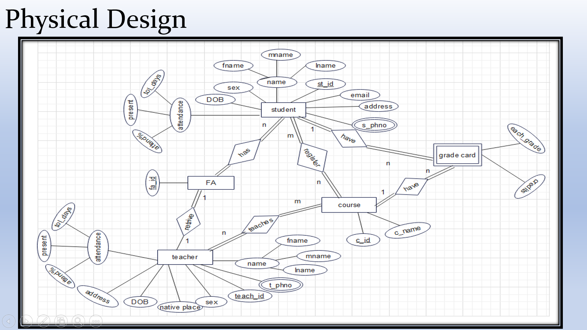

# College Management System

## Table of Contents

- [Project Overview](#project-overview)
- [Installation](#installation)
- [Architechture](#architecture)
- [Screenshots](#screenshots)

## Project Overview

The College Management System is a user-friendly website that efficiently stores and manages student, teacher, and course records. 
Using HTML, CSS, and PHP, it enables CRUD operations, grade tracking, and course enrollment details. There are a set of admins who 
can edit this for a particular college.This comprehensive solution streamlines administrative tasks, enhancing academic record management
for colleges and universities.

## Installation

1. Download the zip folder.
2. Extract the folder.
3. Make sure you have installed the xampp.
4. Place the folder in this location C:\xampp\htdocs
5. Go to your favourite browser and enter

         localhost/{foldername}

## Architecture

         ER Diagram

         Schema Diagram

## Screenshots

      Login Page

      Home Page

      
      Display Page

      
      Entry Page

      
      Database

